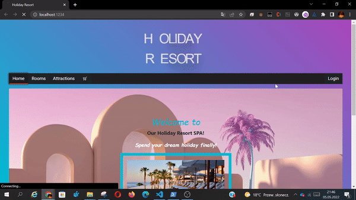
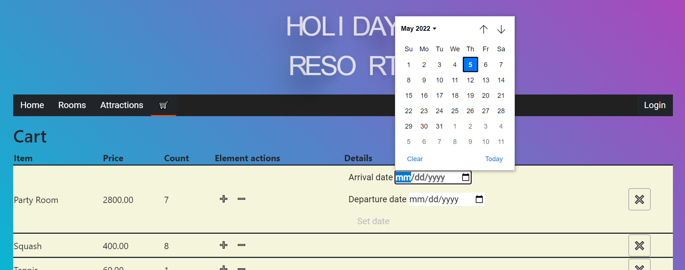
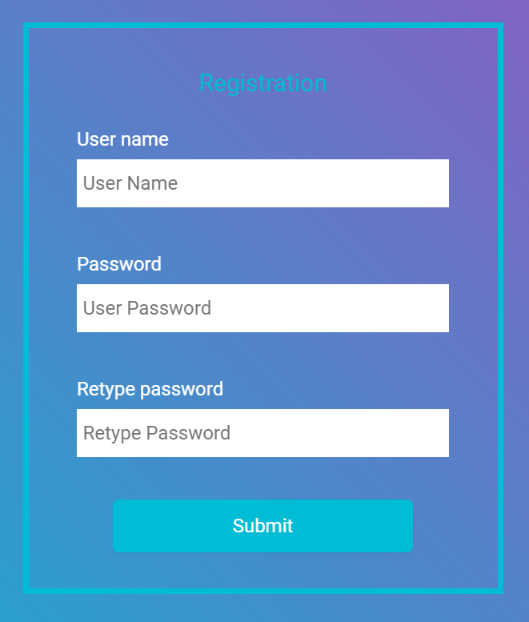
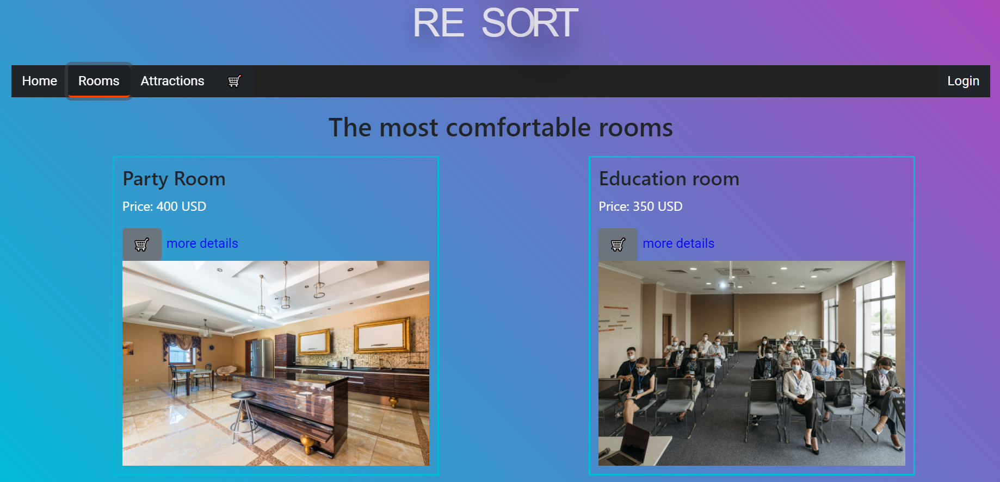
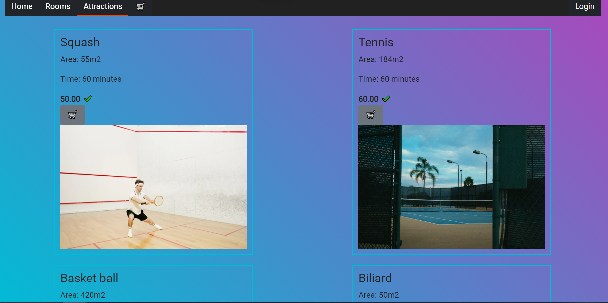

# Holiday Resort

The project consists in writing a Single Page Application for a Holiday Resort dedicated to guests who want to relax.

## Project requirements

The application should enable:

- Browsing available treatments
- Add selected treatments to basket
- Choice of arrival and departure date and room
- User registration
- User login
- Order summary

## Features

### Booking

The shopping cart component that displays a summary of an order.
The shopping cart makes it possible to make corrections to the order.
The user cannot select an arrival date earlier than the current one.
The selected departure date cannot be more than one year from the arrival date.

### Registration

Registration involves storing user details (email and password) in a `database.json` file.
It should not be possible to register a user with an identical email address.

### Login

The login component compares the data (email and password) provided by the user with those in the `database.json` file.

### Rooms

The resort's rooms database is located in the `database.json` file.

### Attractions

The database of sample resort treatments can be found in the `database.json` file.

### Shopping Cart

The shopping cart component, must survive a page reload, so try using cookies.

## Architecture

The project is separated into a separate folder:

- Api - related to the communication with the database
- Common - functions connecting the whole project
- Views - component views

## Database

The database is located in the `database.json` file
from where the data is loaded and the user registration data is saved

## Technologies

- HTML, Bootstrap
- CSS, Sass, LESS
- JavaScript, jQuery
- Node, Express

A `fetch` was used to interact with the database server.
